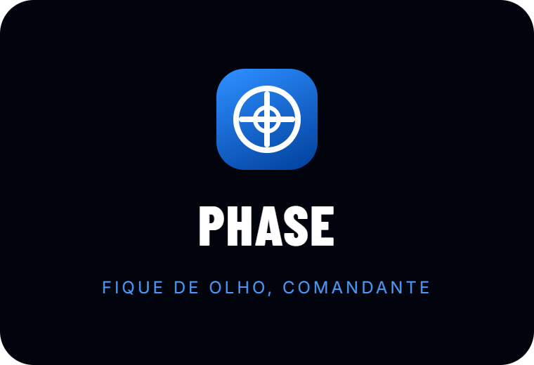
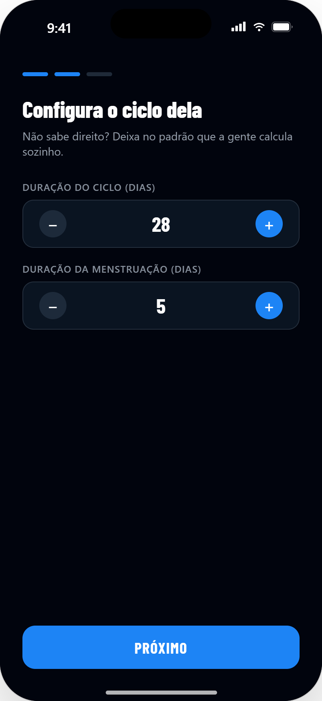
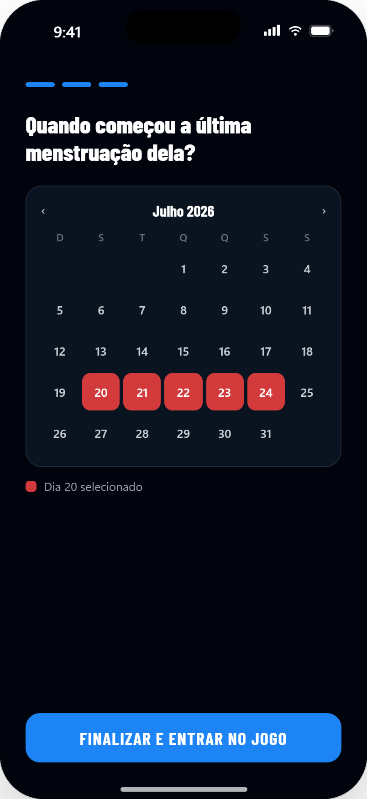
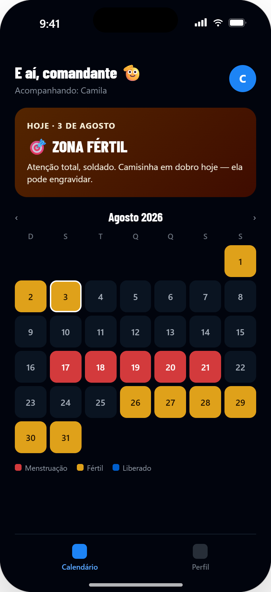
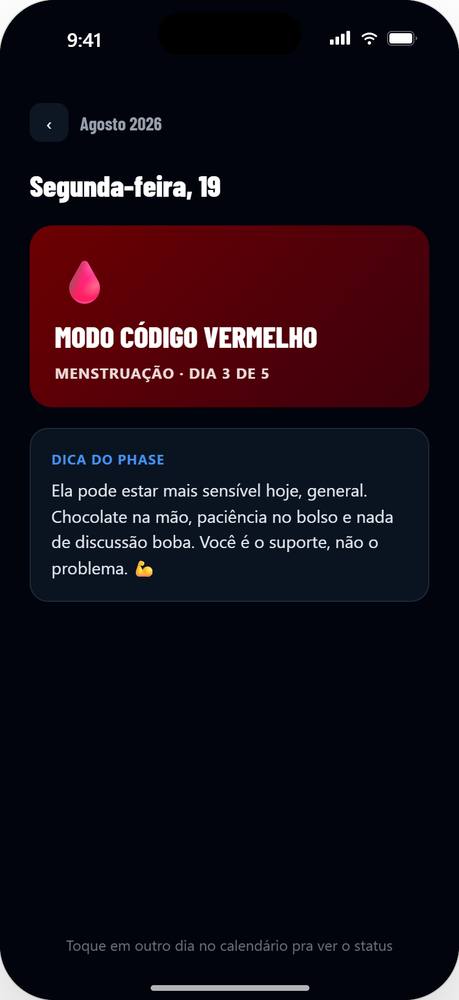

<p align="center">
  
</p>

<p align="center">
  App pra você, guerreiro, acompanhar o ciclo dela e saber exatamente quando é hora de agir com estratégia.
</p>

<p align="center">
  
  
  
</p>

---

## O que é

**Phase** é um app mobile (Expo / React Native) pra namorados, noivos e maridos acompanharem o ciclo menstrual da parceira sem drama: calendário com as fases do ciclo, alertas na hora certa, humor dela registrado dia a dia e um histórico de tudo — com aquele tom brincalhão de "comandante cuidando da missão".

## Telas

<table>
  <tr>
    <td align="center"><br/>Login</td>
    <td align="center"><br/>Cadastro</td>
    <td align="center"><br/>Onboarding</td>
    <td align="center"><br/>Config. do ciclo</td>
  </tr>
  <tr>
    <td align="center"><br/>Última menstruação</td>
    <td align="center"><br/>Calendário</td>
    <td align="center"><br/>Detalhe do dia</td>
    <td align="center"><br/>Ícone do app</td>
  </tr>
</table>

## Funcionalidades

- **Login e cadastro** com conta local (SQLite), sem depender de backend.
- **Onboarding** em 3 passos: nome da parceira, duração do ciclo/menstruação, data da última menstruação.
- **Calendário do ciclo** com as fases do mês (menstruação, período fértil, liberado) e card do dia com dica personalizada.
- **Detalhe do dia**, com explicação da fase e dica bem-humorada — mais um seletor de **humor dela naquele dia** (feliz, neutra, sensível, irritada, cansada).
- **Histórico**: registre o início de um novo ciclo manualmente, veja a duração calculada entre os ciclos anteriores e reveja o humor registrado dia a dia.
- **Perfil** com foto de cada um (você e a parceira), aniversário dos dois, status do relacionamento (namorando / noivos / casados) e data de início do relacionamento — com contagem automática de "há quanto tempo estão juntos".
- **Notificações locais** agendadas automaticamente pra: início do período, período fértil, dias liberados, TPM, aniversário de cada um e aniversário de namoro/noivado/casamento.

## Stack técnica

- [Expo](https://expo.dev) SDK 57 + React Native 0.86, TypeScript
- [`expo-sqlite`](https://docs.expo.dev/versions/latest/sdk/sqlite/) para persistência local (contas, perfil do ciclo, histórico, humor)
- [`expo-notifications`](https://docs.expo.dev/versions/latest/sdk/notifications/) para lembretes locais
- [`expo-image-picker`](https://docs.expo.dev/versions/latest/sdk/imagepicker/) + [`expo-file-system`](https://docs.expo.dev/versions/latest/sdk/filesystem/) pras fotos de perfil
- [`@react-navigation/native-stack`](https://reactnavigation.org/) pra navegação
- Fontes [Barlow Condensed](https://fonts.google.com/specimen/Barlow+Condensed) (títulos) e [Inter](https://fonts.google.com/specimen/Inter) (texto)

## Rodando o projeto

```bash
npm install
npx expo start
```

Escaneie o QR code com o app **Expo Go**, ou rode num emulador Android/iOS.

> ⚠️ **Notificações não funcionam no Expo Go** (removido do Expo Go a partir do SDK 53). Pra testar essa parte de verdade, gere um [development build](https://docs.expo.dev/develop/development-builds/introduction/):
>
> ```bash
> eas build --platform android --profile development
> ```

## Estrutura do projeto

```
src/
├── components/   # UI reutilizável (botões, campos, calendário, seletor de humor, tab bar...)
├── context/      # AppContext — sessão, perfil do ciclo e ações do app
├── db/           # Camada SQLite (conta, perfil do ciclo, histórico de ciclos, humor)
├── navigation/   # Stack de navegação (auth → onboarding → app principal)
├── screens/      # Telas do app
├── theme/        # Cores, tipografia e espaçamentos
└── utils/        # Cálculo de ciclo, conteúdo das fases, notificações, humor
```
